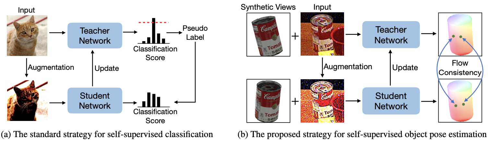
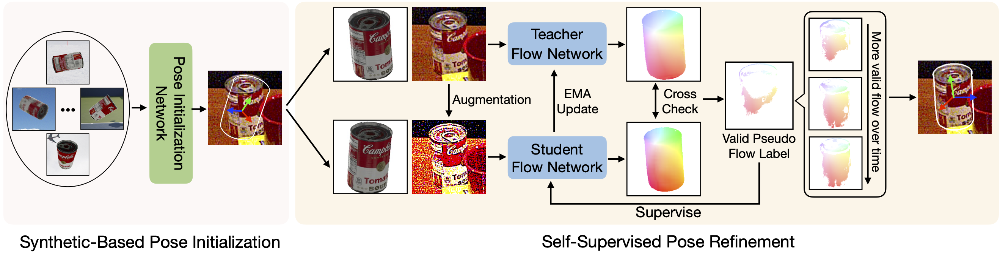

<h1 align="center"> Pseudo Flow Consistency for Self-Supervised 6D Object Pose Estimation </h1>

<h5 align="center"><a href="https://yanghai-1218.github.io">Yang Hai</a>, Rui Song, Jiaojiao Li, David Ferstl, <a href="https://yinlinhu.github.io">Yinlin Hu</a></h5>

<p align="center">
  <a href="https://arxiv.org/abs/2308.10016">Paper</a> |
  <a href="https://yanghai-1218.github.io/publications/PseudoFlow-poster.pdf">Poster</a> |
  <a href="https://www.youtube.com/watch?v=wjm4hLTn5Bw">Video</a>
</p>

# Introduction
<figure>

<figcaption align = "center"><b>Figure 1. Self-supervised strategies in different fields. </b>(a) Teacher-student learning scheme is a classical framework for self-supervised classification. The key is how to determine the quality of pseudo labels from the noisy prediction of the teacher network. For image classification, one can obtain the prediction quality by the output distribution after the softmax operation easily, which is usually implemented by checking if the probability of any class is above a threshold. (b) However, there is no such easy way to determine the quality of an object pose prediction without the ground truth. We propose to formulate pseudo object pose labels as pixel-level optical flow supervision signals, and then use the flow consistency between multiple views based on their underlying geometry constraint.
 </figcaption>
</figure>
<figure>

<figcaption align = "center"><b>Figure 2. Method overview. </b> We first obtain the initial pose based on a pose estimation network trained only on synthetic images, and then train our refinement framework on real images without any annotations. Our proposed framework is based on a teacher-student learning scheme. Given a rough pose initialization, we render multiple synthetic images around this initial pose, and create multiple image pairs between the synthetic and real images. We dynamically produce pixel-level flow supervision signals for the student network during the training, by leveraging the geometry-guided flow consistency between those image pairs from different views. After getting 3D-to-2D correspondences based on the predicted flow, we use a PnP solver to get the final pose.
 </figcaption>
</figure>

# Installation
1. Install necessary packages by `pip install -r requirements.txt`
2. Install Pytorch3D by building [this code repo](https://github.com/YangHai-1218/pytorch3d) from source.
3. Install [bop_toolkit](https://github.com/thodan/bop_toolkit)(Optional).

# Dataset Preparation
1. Download [BOP YCB-V Dataset](https://bop.felk.cvut.cz/datasets/), and place them under `data` directory.
2. Download the image lists and other data related to YCB-V, which will be used in this code, from [here](https://drive.google.com/drive/folders/19ReFWdW6Ly_9epHgtOpmeTNtePFWkAhe).
3. Download the detected bounding boxes by [RADet](http://arxiv.org/abs/2303.12396), from [here](https://drive.google.com/drive/folders/18hBP70Gveh5todH1zrxP37ASa_c9NYUO).

# Training
1. Train the pose initialization network, which is WDR-Pose equipped with RADet pre-processing, on synthetic images.
```shell
python train.py --config configs/estimator/extended_wdr.py --mode estimator
```
2. Train the optical flow network on synthetic images.
```shell
python train.py --config configs/flow_refine/raft_flow_mask.py --mode refiner
```
3. Inference the initial poses of un-annotated real training images.
```shell
python test.py --config configs/estimator/extended_wdr.py --mode estimator --checkpoint work_dirs/wdr_ycbv_pbr/latest.pth --format-only --save-dir data/initial_poses/extended_wdr/ycbv_pbr_train
```
4. Train the optical flow network on un-annotated real images, which will load the pretrained weights and use the above initial poses for training.
```shell
python train.py --config configs/flow_refine/pfc_raft_flow_mask.py --mode refiner
```
Notes: To reproduce the results in our paper, the first three steps can be skipped by accessing the pretrained model weights from [here](https://drive.google.com/drive/folders/1j5joP1MSOJWrp1W28v86M9rxPQLS_iBm) and initial pose of unlabeled real images from [here](https://drive.google.com/drive/folders/1U33pwPyZNtw_zYc9P1O4PEnad_9TaYMj). 

# Testing
1. Infer the initial poses on testing images, and save them.
```shell
python test.py --config configs/estimator/extended_wdr.py --checkpoint work_dirs/wdr_ycbv_pbr/latest.pth --format-only --save-dir data/initial_poses/extended_wdr/ycbv_pbr_test
```
2. Run the trained optical flow network to refine the above initial poses.
```shell
python test.py --config configs/flow_refine/pfc_raft_flow_mask.py --checkpoint work_dirs/pfc_real_selfsup/latest.pth --eval
```
Notes: The trained model on YCB-V can be found [here](https://drive.google.com/drive/folders/1j5joP1MSOJWrp1W28v86M9rxPQLS_iBm) and initial pose for testing images can be found [here](https://drive.google.com/drive/folders/1U33pwPyZNtw_zYc9P1O4PEnad_9TaYMj).
## Evaluation under BOP setting(optional)
1. Save the results.
```shell
python test.py --config configs/flow_refine/pfc_raft_flow_mask.py --checkpoint work_dirs/pfc_real_selfsup/latest.pth --format-only --save-dir work_dirs/pfc_real_seflsup/results
```
2. Convert to BOP format.
```shell
python tools/convert_to_bop19.py work_dirs/pfc_real_seflsup/results data/ycbv/test_targets_bop19.json work_dirs/pfc_real_seflsup/results_bop19.json
```
3. Follow the bop_toolkit instruction for evaluation. 
# Citation
If you find this project is helpful, please cite:
 ```
 @inproceedings{yang2023pfcflow,
   title={Pseudo Flow Consistency for Self-Supervised 6D Object Pose Estimatio},
   author={Yang Hai and Rui Song and Jiaojiao Li and David Ferstl and Yinlin Hu},
   booktitle={ICCV},
   year={2023}
 }
 @inproceedings{yang2023pfcflow,
   title={Rigidity-Aware Detection for 6D Object Pose Estimation},
   author={Yang Hai and Rui Song and Jiaojiao Li and Mathieu Salzmann and Yinlin Hu},
   booktitle={CVPR},
   year={2023}
 }
 @inproceedings{yinlin2022wdr,
   title={Wide-Depth-Range 6D Object Pose Estimation in Space},
   author={Yinlin Hu, Se ́bastien Speierer, Wenzel Jakob, Pascal Fua, Mathieu Salzmann},
   booktitle={CVPR},
   year={2022}
 }
 ```
# Acknowledgement
We thank the authors of [WDR-Pose](https://github.com/cvlab-epfl/wide-depth-range-pose) and [SCFlow](https://github.com/YangHai-1218/SCFlow) for their great code repositories.